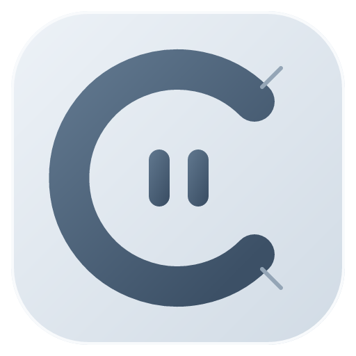

<div align="center">



# OmiComic

Windows 本地漫画、图片与电子书阅读器。


[下载安装包](https://github.com/lorcinv/OmiComic/releases/tag/v0.2.0) · [使用方法](README_使用方法.md) · [版本更新](CHANGELOG.md)

</div>

## 安装

下载 **OmiComic-Setup-0.2.0-x64.exe**，按提示选择安装目录。安装包约 96 MiB，程序文件约 326 MiB。

- 安装到当前用户，创建桌面和开始菜单快捷方式。
- Windows“已安装的应用”可识别名称、版本、图标和卸载入口。
- 在文件的“打开方式”中选择 OmiComic；安装不会更改已有默认程序。
- 卸载保留阅读数据和原始漫画文件。
- 当前安装包未做数字签名，Windows 首次下载或运行可能显示发布者/SmartScreen 提示。

## 主要功能

- **首页**：最近三本、阅读进度、镜像漫画场景和品牌转场；点击 OmiComic 文字切换首页，图标继续阅读。
- **资源整理**：多根目录、自然排序、搜索、标签、简介、收藏、书签、书架、批量选择和内部引用排序。
- **临时存放**：直接从系统打开、尚未加入资源库的文件保存在这里；右键可删除临时引用，或将所在目录加入资源库。
- **自适应卡片**：七档拖动滑条，默认每行四张；Ctrl＋滚轮上滚放大、下滚缩小，每档铺满当前内容宽度。资源库与详情分别保存档位。
- **详情预览**：封面、续读、标签、简介和每组最多 48 页的按需缩略图；下滚先折叠详情，上滚到顶后略加滚动展开。
- **统一阅读窗口**：图片、压缩包、PDF 和 EPUB 共用工具栏、阅读方向、全景滚动、适应尺寸、进度跳转及书签。
- **阅读手感**：单页/双页、横向/纵向全景、加速拖动与惯性、跳转动画、沉浸全屏、预加载和缓存设置。
- **主题**：经典雾灰、北境雾蓝、暖砂、暮夜灰；控件保持统一圆角与仿玻璃外观。

## 格式支持

| 资源 | 读取方式 |
| --- | --- |
| 图片文件夹、单张图片 | JPG、JPEG、PNG、WebP、BMP、GIF；单图打开时定位到所在目录的对应页 |
| ZIP / CBZ | 按自然顺序读取归档内图片 |
| RAR / CBR、7z / CB7 | 随应用提供 7-Zip，后台按页读取 |
| PDF | 本地 PDF.js worker、分段读取、按页渲染 |
| EPUB | 后台按章解析，净化文本与位图后隔离显示 |

PDF/EPUB 共用阅读窗口；EPUB 以完整章节为阅读单元，进度和书签按章节记录。文档封面及详情缩略图仍使用格式占位。EPUB 不保留出版方完整样式、SVG、远程或交互内容，不支持 DRM；密码保护及多卷归档不支持。

## 数据

漫画内容只在本机读取。整理、删除引用、收藏、书签和书架不会移动或删除原文件。

设置和阅读记录保存在 Electron `userData/omicomic-data.json`。升级沿用已有数据，卸载保留该目录。备份或迁移时保留整个用户数据目录。

归档、图片和文档有读取大小、条目数量、超时等限制，见 [归档边界](tests/ARCHIVE_STRESS.md)。缓存设置限制预加载与保留内容，并非整个应用进程的内存硬上限。

## 从源码运行与打包

环境：Windows x64、Git、Node.js 24 和 npm。

```powershell
git clone https://github.com/lorcinv/OmiComic.git
cd OmiComic
git checkout v0.2.0
npm ci
npm run dev
```

| 命令 | 用途 |
| --- | --- |
| `npm run build` | 类型检查、渲染进程和 Electron 构建 |
| `npm start` | 启动已构建的应用；源码更新后应先重新构建 |
| `npm run dist:win` | 生成图标、构建并输出 x64 EXE 安装包到 `release/` |
| `npm run package:dir` | 生成可直接运行的 `release/win-unpacked/OmiComic.exe` |
| `npm test` | 文件服务、数据、归档、文档与阅读算法测试 |
| `npm run test:dom` | React 状态与交互回归 |
| `npm run test:ui` | 浏览器布局、阅读和交互回归 |
| `node --test tests/packaged.electron.cjs` | 实际打包 EXE 的多格式阅读与持久化验证 |

打包保留当前架构的 7-Zip、必要语言和依赖，将 EPUB worker 放到 ASAR 外；不会把源码、测试、开发工具或完整 `node_modules` 放进安装包。图标源文件为 [resources/icon.svg](resources/icon.svg)。

## 项目文档

- [使用方法](README_使用方法.md)
- [功能与交互逻辑](功能以及交互逻辑.md)
- [版本更新](CHANGELOG.md)
- [当前项目状态](PROJECT_STATUS.md)
- [验证记录与范围](docs/VERIFICATION.md)
- [早期开发变更归档](docs/status/PROJECT_CHANGELOG_INDEX.md)

## 许可证

本项目暂未提供开源许可证。第三方许可证与声明随应用分发，仓库中的归档组件声明见 [licenses](licenses/)。

7-Zip 26.04 按原样分发，其对应源码作为同版本 Release 附件提供；Electron/Chromium、PDF.js 和其他运行依赖的完整许可证保留在应用资源中。
